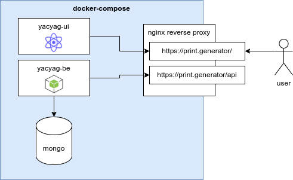
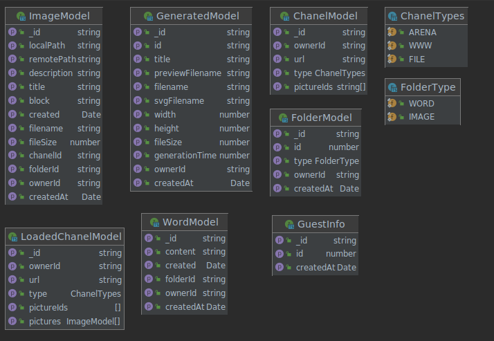

# print.generator
Basic docs about print generator deployment. How to run FE and BE is situated in root folders of each service in README.md.

## Deployment

- 
For first deployment to server use:
- create network print-generator.app ```docker create network print-generator.app```
- connect network to exsisting nginx-reverse-proxy container (better with letsencrypt companion) ```docker connect print-generator.app nginx-reverse-proxy```
- run ```docker-compose up -d```
- should get results on https://print-generator.app

### Technology summary
#### Backend
- `Node + Typescript` - a lot lines of code from
  [this repo](https://github.com/microsoft/TypeScript-Node-Starter/)
    - `express` handling API calls
    - `are.na` one of the first dependencies - [arena scrapper](https://www.npmjs.com/package/are.na)
    - `sharp` [image manipulation library](https://sharp.pixelplumbing.com/) which we used for image processing and SVG to PNG conversion
    - `xml-js` it was a lot of pain to work with SVG in BE so sharp can convert it successfully, this thing helped a lot (more on it in _tool_ part)
- `MongoDB` - for persistency, it's so smooth to work with that from Node

#### Frontend
- `pReact + Typescript` - 
    - `redux` storage of application states - mainly for user
    - `save-svg-as-png`

#### Deployment
Both FE and BE are using `Docker` for packaging. FE is packed together with `nginx` webserver
for serving static JS files, but BE uses `express` to serve on port 3000. Both parts are integrated using
`docker-compose` together with another `nginx` server for serve those microservices in one neat package.

I wanted to establish some CI/CD pipeline in `gitlab` or `teamcity`, for deployment directly from GIT, but realized it is too
much work for this `alpha` version. So maybe in the future?


#### The tool routine
Tool routine is present in FE project.

Brain of whole operation. It took all words, pictures and settings and did some black magic with that.
Process of tool can be summarized in those steps:
1. Download all words from user folders
2. Download all pictures from user folders and determine their dimensions and ratio. Work just with thumbnails for performance reasons.
3. Load settings so you know which `magic` to use
4. Place all elements - use `SVG` element to place `<text>` and `<image>` into svg plane which has dimensions from user settings (A3).
5. Show `SVG` to user and let him decide if he wants to save the result.
6. Send result `SVG` into BE.
7. Backend will parse `SVG/XML` document and replace thumbnail images with originals.
8. Backend will go throught all elements on `SVG` plane and recalculate all images into 300 DPI using library `sharp` and algorithm `lanczos3`
9. It will save `SVG` and again use `sharp` library to generate `PNG`
10. Then result is saved and send back to user. File size varies, but its quite big around 3 MB to 20 MB.

There were few more requirements for this steps:
- **multiple composition strategies** - this ended up just at random and grid strategies. Grid strategy is much more
  complex. Fitting text which has so many ways of placement into grid with some other images was the hardest challenge.
  After some discussions with 👑 on how to solve that we decided to fix `block-width` and move just with
  `block-height` and `font-size`.
- **see result in realtime** - for tweaking shuffle algorithms. Creating thumbnails first and then rendering result file in backend helped a lot.
- **multiple lines text** - Dear reader, did you know that plain `SVG 1.1` does not support block text by default?
  I did not. I had to implmenet it myself and it was a pain. I was using function which can determine text width with given font and font-size.
  If it was bigger than needed `block-width` i stripped one world from end and looped that recursively. Now you know.


## Model

